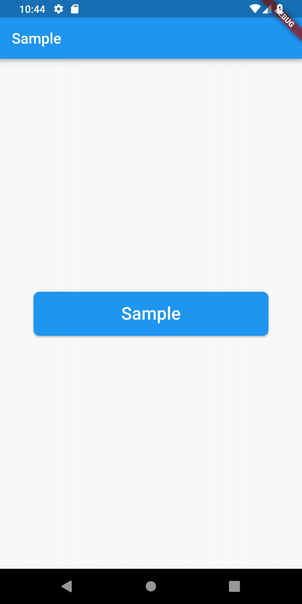

# Progress Button

[](https://pub.dartlang.org/packages/progress_indicator_button/) [](https://cirrus-ci.com/github/PascalAC/progress_button) [](https://www.paypal.com/cgi-bin/webscr?cmd=_s-xclick&hosted_button_id=KQ8V6BELJP47G)

A simple button that gives you the possibility to 
transform into a circular one and shows a progress indicator.



## How to use

```dart
ProgressButton(
    width: 320,
    height: 60,
    borderRadius: BorderRadius.all(Radius.circular(8)),
    child: Text(
        "Sample",
        style: TextStyle(
        color: Colors.white,
        fontSize: 24,
        ),
    ),
    onPressed: (AnimationController controller) {
        if (controller.isCompleted) {
            controller.reverse();
        } else {
            controller.forward();
        }
    },
)
```

Please check the sample folder for a simple implementation.

## Changelog

Please see the [Changelog](CHANGELOG.md) page to know what's recently changed.

## Contributions

Feel free to contribute to this project.

If you find a bug or want a feature, but don't know how to fix/implement it, please fill an [issue](https://github.com/PascalAC/progress_button/issues).  
If you fixed a bug or implemented a new feature, please send a [pull request](https://github.com/PascalAC/progress_button/pulls).

## License

This project is licensed under the MIT License - see the [LICENSE.md](LICENSE.md) file for details
